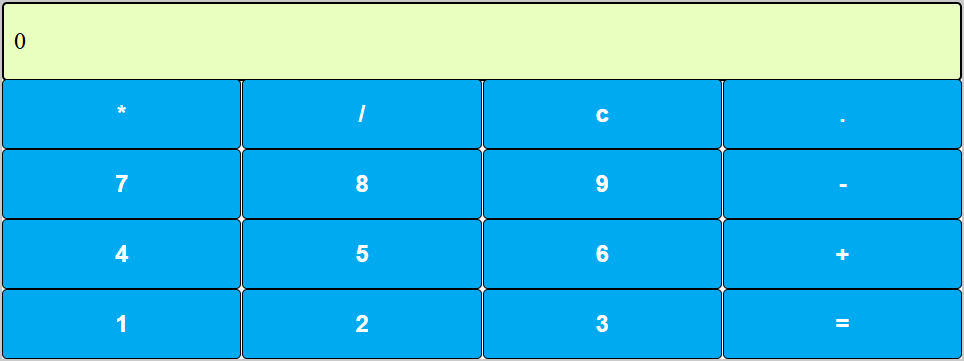

# 🖩 Calculadora em React

Este é o projeto de uma calculadora desenvolvida em React como primeiro desafio da trilha React Developer plataforma **DIO (Digital Innovation One)**. A estrutura base do projeto já veio pronta e foram implementadas as funções de multiplicação e divisão. Também tomei a liberdade de fazer algumas alterações estéticas em bordas e cores.

---

## 🔹 Funcionalidades
✅ Realiza operações básicas: **adição, subtração, multiplicação e divisão**  
✅ Interface simples e responsiva  
✅ Estilização com **Styled Components**  
✅ Ajustes visuais, como bordas nos botões e personalização do visor  

---

## 🔧 Tecnologias Utilizadas
- **React.js**
- **JavaScript (ES6+)**
- **Styled Components**

---

## 📌 Melhorias Implementadas
Como parte do desafio, foram feitas algumas melhorias específicas no projeto:

2️⃣ **Prevenção de erro de divisão por zero**: adicionado um alerta para impedir essa operação.  
3️⃣ **Melhoria no design**:
   - Adição de **bordas entre os botões** para melhor separação visual.
   - Alteração da **cor do visor** para um tom mais adequado.

---

## 📷 Captura de Tela

---

## 📌 Sobre o Autor
Este projeto foi desenvolvido como parte de um desafio na plataforma **DIO**. As correções e melhorias foram implementadas por **Matheus G. Sturmer**.